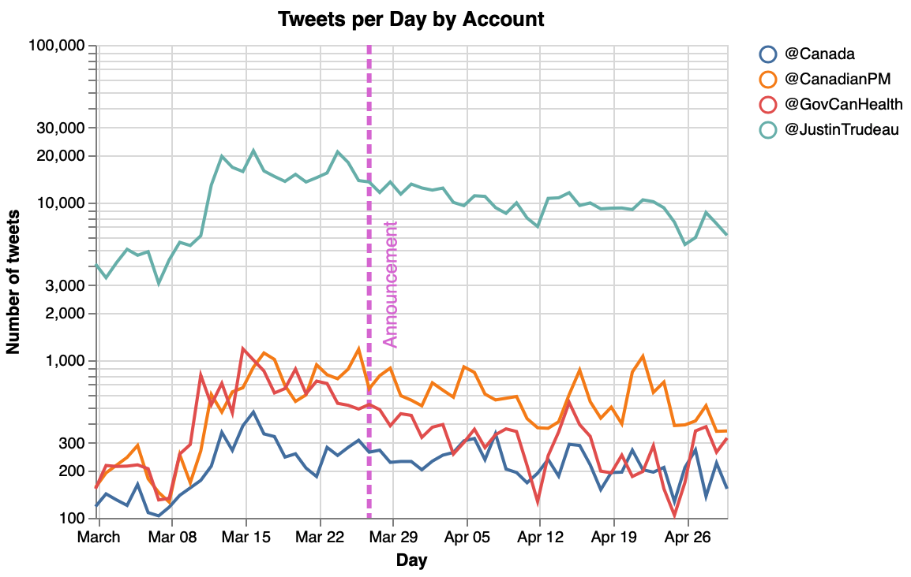
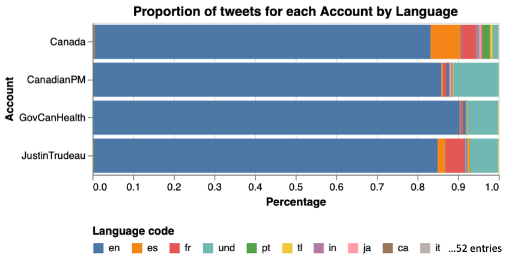
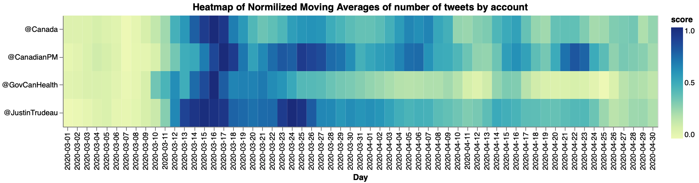
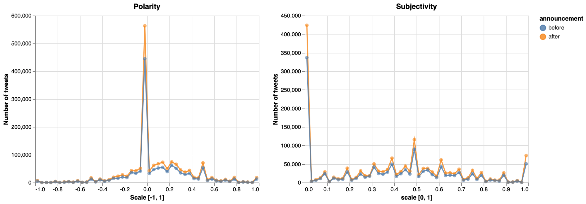
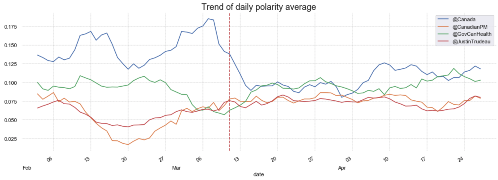
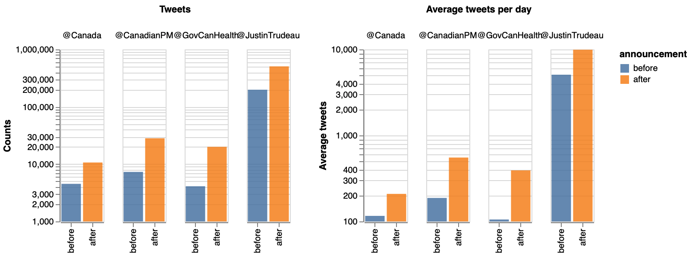
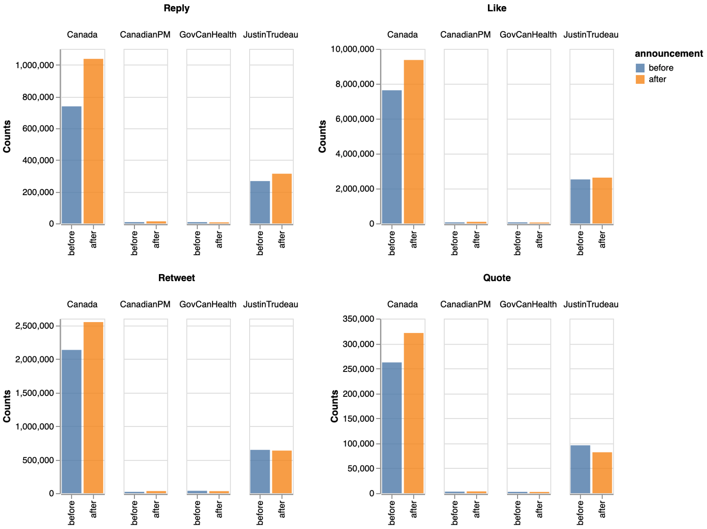

# Canada response to Covid-19
*Sentiment analysis of people's tweets referring to Canadian Government's accounts after Government announcement of policies as response of Covid-19.*

[](https://opensource.org/licenses/MIT)

## Authors
|Name |Github| Webpage |
|:----|:-----|:-------:|
|Victor Cuspinera | [vcuspinera](https://github.com/vcuspinera) | [](https://vcuspinera.github.io) |
|Leopoldo Cuspinera | [cuspime](https://github.com/cuspime) | [](https://cuspime.github.io) |

## Overview
The idea of this project was born on March 2020, when the Prime Minister of Canada, Justin Trudeau, announced a series of policies to help Canadians cope with the COVID-19. While the first annoucement on [March 11th, 2020, outlined Canada’s whole-of-government response to COVID-19 outbreak](https://youtu.be/YunI2PNZKxg), in the posterior press conferences of [March 13th](https://www.youtube.com/watch?v=u70pUm7xHo0&t=38s) and [March 27th](https://youtu.be/1o-tV0A87l8) the Prime Minister announced the how stimulus package would be address to those affected by the pandemic as small bussiness and employees.

The objective of this project is to analyse the Canadian Government response to Covid-19 through the perception of the people by making sentiment analysis on people's tweets mentioning Canadian Government's accounts as [@JustinTrudeau](https://twitter.com/JustinTrudeau?s=20), [@CanadianPM](https://twitter.com/CanadianPM), [@Canada](https://twitter.com/canada?lang=en) and [@GovCanHealth](https://twitter.com/govcanhealth?lang=en).

## Retrieving tweets
To compare the tweets before and after Trudeau announcement, the first step was getting the tweets from February 1st to April 30th, from the four accounts of the Canadian Government mentioned in the previous section.

### Getting the tweets
#### What didn't work: `Twitter API` and `GetOldTweets3` library
Our first attempt was using the [Twitter API](https://github.com/vcuspinera/Canada_response_covid/blob/master/src/twitter-search_v1_TwitterAPI.ipynb). For this reason, we get a twitter developer's account<sup><a name="myfootnote1">1</a></sup>. However, the standard twitter developer's account only gives access to search historic databases with a 7-day limit, which means we were not able to reach tweets that were older than a week and so this approach was discarded.

As a second approach we used the [GetOldTweets3 library](https://github.com/vcuspinera/Canada_response_covid/blob/master/src/twitter-search_v2_GetOldTweets3.ipynb), which initially gave us satisfactory results.
However due the changes in Twitter's API in late 2020, GetOldTweets3 is no longer functioning.

#### What worked for the current version of the project: `snscrape` library

Our final and successful approach to get the wanted tweets was using the [snscrape](https://github.com/vcuspinera/Canada_response_covid/blob/master/src/twitter-search_v3_snscrape.ipynb). 

In this case, we use the development version of snscrape to access information directly from tweets instead of tweet URLs:
```
!pip3 install git+https://github.com/JustAnotherArchivist/snscrape.git
```

An important point is that this package works directly from the terminal with Command Line Interface (CLI) so, in this case, we didn't need to call it as a library but we use the OS library for Python to execute snscrape with CLI commands in Python. In the next code chunk, you could find how to use it in jupyter:

```python
# Libraries
import os
import pandas as pd

# Use OS library to call snscrape with CLI in Python and save tweets
os.system("snscrape --jsonl --max-results 1_000 --since 2020-02-01 twitter-search 'JustinTrudeau until:2020-02-02' > ../tweets/JustinTrudeau_2020-02-01.json")

# Call tweet's json files as Data Frame
df = pd.read_json('../tweets/JustinTrudeau_2020-02-01.json', lines=True)
```

With the snscrape package we download as many as 100,000 tweets per day for each Twitter account of the Government of Canada. This means that we got 360 `JSON` files, and stored them in [the _tweets_ folder](https://github.com/vcuspinera/Canada_response_covid/tree/master/tweets) of this repository.

Subsequently, we merged some selected columns of these files in one file named *tweets_db.json*

[⭐️ click here](https://github.com/vcuspinera/Canada_response_covid/blob/master/src/twitter-search_v3_snscrape.ipynb) to see more details about how we download tweets with `snscrape`.

### Preprocessing tweets
Our final step of this section was [preprocessing the tweets](https://github.com/vcuspinera/Canada_response_covid/blob/master/src/preprocess.py) to delete some of the sensible information as emails and urls.<sup><a name="myfootnote2">2</a></sup> You can run the preprocess.py script by writing in the Terminal at the main folder of this repository:

```
python src/preprocess.py --input_dir=tweets/ --output_dir=tweets/
```

## EDA
When comparing the tweets per day by Canadian Government Twitter accounts, we find that between February and April 2020, the [@JustinTrudeau](https://twitter.com/JustinTrudeau) account had between 3.0 and 21.4 thousand tweets per day. With fewer tweets [@Canada](https://twitter.com/Canada) had between 98 and 470 tweets, [@CanadianPM](https://twitter.com/CanadianPM) had between 104 and 1,179 tweets, and [@GovCanHealth](https://twitter.com/GovCanHealth) between 30 and 1,182 tweets per day.



In this section we identify that tweets mainly in English (`en`), that represents 85.5% of all tweets. It follows a group of undefined language (`und`) with 8.2%. The third and fourth languages in the database are French (`fr`) with 3.5% and Spanish (`es`) with 1.2%

Most tweets were written in English (`en`), which  represent 85.5% of all tweets. It follows a group of undefined language (`und`) with 8.2%. The third and fourth languages in the database are French (`fr`) with 3.5% and Spanish (`es`) with 1.2%. For the main analysis we used tweets wrote in English. This enhanced the reach of powerful tools like [spacy](https://spacy.io), [textblob](https://textblob.readthedocs.io/en/dev/) and [wordcloud](https://amueller.github.io/word_cloud/index.html), mainly developed for this language.



We calculate the Moving Averages with 7-day window, and normalize these averages by account using minimum and maximum number of tweets. With this analysis we identify the days with more tweets, removing weekly seasonality. 

In this plot we can identify an increase in number of tweets for all the Canadian Government's Twitter accounts around March 11th, 2020, with a peak of tweets between March 14th and 17th, decreasing from this point on until return to lower levels in mid April 2020.



⭐️ More details of the basic analysis and EDA of this report are available [in this link](https://github.com/vcuspinera/Canada_response_covid/blob/master/src/eda.ipynb).

## Sentiment Analysis
For sentiment analysis we select only tweets written in English, and use descriptive statistics based in counts of words, word clouds and scores get by [spaCy](https://spacy.io).

When comparing word clouds of tweets published before and after the announcement, we observe that the most used words and their repetitions are very similar among both groups.


Additionally, we explore sentiment analysis with [spaCy](https://spacy.io)'s `polarity` and `subjectivity`, by looking at the log number of tweets.<sup><a name="myfootnote3">3</a></sup>  

In this case, we observe that the information from tweets before and after the announcement have very similar Polarity and Subjectivity curves. Talking about polarity, in both groups we see mainly neutral tweets skewed to be positive. In the other hand, these tweets were much more objective than subjective. We also perform hypothesis testing polarity and subjectivity on tweets before and after the announcement on sub-samples of tweets, but we couldn't reject that both means of these measures were different.



We also use Time Series find the Trend of polarity and number of tweets. From this analysis, we find that before March 11th the trend polarity average of @Canada was the higher to the period after the annoucement. In contrast, the trend of polarity average was lower before than after the annoucement for the @CanadianPM and @JustinTrudeau accounts. In addition, the @GovCanHealth had almost the same levels.

In short, while the trend in sentiment decrease because for @Canada account, weets related with the Canadian Prime Minister (@CanadianPM and @JustinTrudeau) had a possitive impact after the annoucement.



Finally, the announcement also impacted in the volume of tweets, as well the actions and reactions of users increasing the number of likes, replies, retweets and quotes.





[⭐️ click here](https://github.com/vcuspinera/Canada_response_covid/blob/master/src/sentiment_analysis.ipynb) to see more details about the sentiment analysis.

## Final comments
The aim of this project was to measure the impact of the Government policies to help Canadians cope with the COVID-19.

For this reason, we compare the sentiment analysis on Canadians before and after Trudeau's first announcement on March 11<sup>th</sup>, 2020, where the Prime Minister outlined Canada’s whole-of-government response to COVID-19 outbreak.

To measure this impact download tweets from February 1<sup>st</sup> to April 30<sup>th</sup> mentioning any of the four selected Canadian Government's Twitter accounts ([@JustinTrudeau](https://twitter.com/JustinTrudeau?s=20), [@CanadianPM](https://twitter.com/CanadianPM), [@Canada](https://twitter.com/canada?lang=en) and [@GovCanHealth](https://twitter.com/govcanhealth?lang=en)), and compare the polarity and subjectivity of tweets published before and after the announcement.

On the analysis we find that the announcement on March 11<sup>th</sup>, and the following announcements of the Government policies related with COVID-19, had an impact in the volume and sentiment of tweets: 

- __Sentiment__: while the overall sentiment of tweets is positive, the announcement had different effect for the Government accounts. While the effect on @Canada account was a decrease in the average polarity, in the other hand we identify a rise in the positive sentiment of tweets related with the Canadian Prime Minister (which means an increase in the polarity levels of @CanadianPM and @JustinTrudeau accounts). The @GovCanHealth account was stable in polarity level before and after the announcement. 
- __Volume__: we observed an increase in the total number of tweets and the average tweets per day. Also, the noncement affected the volume of actions and reactions of users increasing the number of likes, replies, retweets and quotes.

## Dependencies
|Python packages|Python packages|
|:------|:---|
|altair |re  |
|collections|scipy |
|datetime|seaborn |
|docopt |spacy|
|en_core_web_sm|spacytextblob |
|GetOldTweets3 |string|
|json   |textblob |
|matplotlib |textblob |
|numpy  |time|
|os     |twitter|
|pandas |warnings|
|PIL    |wordcloud |
|pytz   | |

## Usage
### Running recipe (recommended)
To replicate the analysis, clone this GitHub repository and follow the next steps:

1. Install the [dependencies](#dependencies) listed above.  

2. Open [`twitter-search_v2_GetOldTweets3.ipynb`](https://github.com/vcuspinera/Canada_response_covid/blob/master/src/twitter-search_v3_snscrape.ipynb) notebook located in the _src_ folder, and run all cells.

3. Run the Python script [`preprocess.py`](https://github.com/vcuspinera/Canada_response_covid/blob/master/src/preprocess.py) in the terminal from the root directory of this project to identify and delete sensible information.
_⚠️ Caution: [this process take close to two hours.](https://github.com/vcuspinera/Canada_response_covid/blob/master/img/preprocess_times.png)_
```
python src/preprocess.py --input_dir=tweets/ --output_dir=tweets/
```

4. Open and run [`eda.ipynb`](https://github.com/vcuspinera/Canada_response_covid/blob/master/src/eda.ipynb) notebook located in the _src_ folder.

5. Open and run [`twitter_trend.ipynb`](https://github.com/vcuspinera/Canada_response_covid/blob/master/src/twitter_trend.ipynb) notebook.

6. Run the Python script [`tweets_sentiment.py`](https://github.com/vcuspinera/Canada_response_covid/blob/master/src/tweets_sentiment.py) in the terminal to select only tweets written in English and add Polarity and Subjectivity scores from spaCy.  
_⚠️ Caution: [this process take a long time to run it, in my case it took 13 hr.](https://github.com/vcuspinera/Canada_response_covid/blob/master/img/tweets_sentiment_times.png)_
```
python src/tweets_sentiment.py --input_file=tweets/tweets_db_clean.json --output_dir=tweets/
```

7. Open and run [`sentiment_analysis.ipynb`](https://github.com/vcuspinera/Canada_response_covid/blob/master/src/sentiment_analysis.ipynb) notebook.

## Main references
- Prime Minister outlines Canada’s COVID-19 response, on March 11 of 2020: [official announce](https://pm.gc.ca/en/news/news-releases/2020/03/11/prime-minister-outlines-canadas-covid-19-response) and [video](https://youtu.be/YunI2PNZKxg).
- [@JustinTrudeau](https://twitter.com/JustinTrudeau?s=20). Official account of Justin Trudeau as public person, and 23rd Prime Minister of Canada. Twitter.
- [@CanadianPM](https://twitter.com/CanadianPM). Official account of the Prime Minister of Canada. Twitter.
- [@Canada](https://twitter.com/canada?lang=en). Showcasing Canada to the world. Twitter.
- [@GovCanHealth](https://twitter.com/govcanhealth?lang=en). Health Canada and Public Health Agency of Canada. Twitter.

[⭐️ Click here](https://github.com/vcuspinera/Canada_response_covid/blob/master/References.md) to access the complete list of references for this project.

<br>

---
<sup>[[1]](#myfootnote1) If you are interested to get the twitter developer's account, [click here](https://github.com/vcuspinera/Canada_response_covid/tree/master/keys) to see details and recommendation to get one.</sup>

<sup>[[2]](#myfootnote2) We didn't delete all the sensible information nor anonymize the tweets because we loosed important tokens as _Trudeau_ or the tags to official Twitter accounts of Canadian Government.</sup>

<sup>[[3]](#myfootnote3) `polarity` score is a float within the range [-1.0, 1.0] where -1.0 is a very negative tweet and 1.0 is positive one. In the other hand, `subjectivity` is a float within the range [0.0, 1.0] where 0.0 is very objective and 1.0 is very subjective.</sup>
