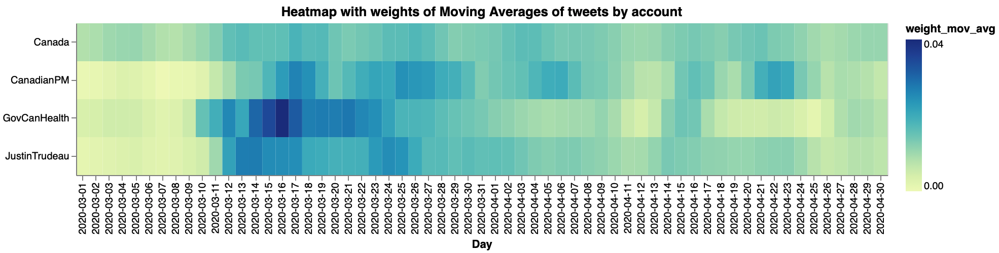

# Canada response to Covid-19
*Sentiment analysis of people's tweets refeering to Canadian Government's accounts after Government announcement of policies as response of Covid-19.*

[](https://opensource.org/licenses/MIT)

## Authors
|Name |Github| Webpage |
|:----|:-----|:-------:|
|Victor Cuspinera | [vcuspinera](https://github.com/vcuspinera) | [](https://vcuspinera.github.io) |
|Leopoldo Cuspinera | [cuspime](https://github.com/cuspime) | [](https://cuspime.github.io) |

## Overview
The idea of this project was born after March 27th, 2020, when the Prime Minister of Canada, Justin Trudeau, [announced a series of policies facing impacts of Covid-19](https://youtu.be/1o-tV0A87l8) to support small businesses and their employees.  

The objective of this project is to analyse the Canadian Government response to Covid-19 through the percepetion of the people by making sentiment analysis on people's tweets mentioning Canadian Government's accounts as [@JustinTrudeau](https://twitter.com/JustinTrudeau?s=20), [@CanadianPM](https://twitter.com/CanadianPM), [@Canada](https://twitter.com/canada?lang=en) and [@GovCanHealth](https://twitter.com/govcanhealth?lang=en).

## Retrieving tweets
To compare the tweets before and after Trudeau announcement, the first step was getting the tweets from March 1st to April 30th, from the four official-accounts selected from the Government of Canada.

### Getting the tweets
#### What didn't work: `Twitter API` and `GetOldTweets3` library
Our first attempt was using the [Twitter API](https://github.com/vcuspinera/Canada_response_covid/blob/master/src/twitter-search_v1_TwitterAPI.ipynb). For this reason we get a twitter developer's account<sup><a name="myfootnote1">1</a></sup>. However, the standard twitter developer's account only gives access to search historic databases with a 7-day limit, which means that I was not able to find tweets for a date older than one week, so this approach was not useful for the objective of our project.

For our second approach we used the [GetOldTweets3 library](https://github.com/vcuspinera/Canada_response_covid/blob/master/src/twitter-search_v2_GetOldTweets3.ipynb). This innitially worked, however due the changes in Twitter's API in late 2020, GetOldTweets3 is not longer functioning.

#### What worked for teh project: `snscrape` library

Our final and succesful approach to get the wanted tweets was using the [snscrape](https://github.com/vcuspinera/Canada_response_covid/blob/master/src/twitter-search_v3_snscrape.ipynb). This package allowed us to find old tweets as opposed to the free version of the API from twitter, and the GetOldTweets3 library that is non-currently working.

In this case, we use the development version of snscrape to access information directly from tweets instead of tweet URLs:
```
!pip3 install git+https://github.com/JustAnotherArchivist/snscrape.git
```

An important point is that this package works directly from the terminal with Command Line Interface (CLI) so, in this case, we didn't need to call it as a library but we use the OS library for Python to execute snscrape with CLI commands in Python. In the next code chunk you could find how to use it in jupyter:

```python
# Libraries
import os
import pandas as pd

# Use OS library to call snscrape with CLI in Python and save tweets
os.system("snscrape --jsonl --max-results 1_000 --since 2020-05-01 twitter-search 'JustinTrudeau until:2020-05-02' > ../tweets/JustinTrudeau_2020-05-01.json")

# Call tweet's json files as Data Frame
df = pd.read_json('../tweets/JustinTrudeau_2020-05-01.json', lines=True)
```

With the snscrape package we download as much as 100,000 tweets per day for each Twitter account of the Government of Canada. This means that we got 244 `JSON` files, and stored them in [the _tweets_ folder](https://github.com/vcuspinera/Canada_response_covid/tree/master/tweets) of this repository.

Subsequently, we merged some selected columns of these files in one file named *tweets_db.json*

[👉 click here](https://github.com/vcuspinera/Canada_response_covid/blob/master/src/twitter-search_v3_snscrape.ipynb) to see more details about how we download tweets with `snscrape`.

### Preprocessing tweets
Our final step of this section was [preprocessing the tweets](https://github.com/vcuspinera/Canada_response_covid/blob/master/src/preprocess.py) to delete some of the sensible information as emails and urls.<sup><a name="myfootnote2">2</a></sup> You can run the preprocess.py script by writing in the Terminal at the main folder of this repository:

```
python src/preprocess.py --input_dir=tweets/ --output_dir=tweets/
```

## EDA
When comparing the tweets per day by Canadian Government Twitter accounts, we find that between March and April 2020, the [@Canada](https://twitter.com/Canada) account had between 29.1 and 62.4 thousand tweets per day, followed by [@JustinTrudeau](https://twitter.com/JustinTrudeau) in a range of 3.5 to 29.7 thousand tweets per day. With much fewer tweets, [@CanadianPM](https://twitter.com/CanadianPM) had between 131 and 1,207 tweets, and [@GovCanHealth](https://twitter.com/GovCanHealth) between 105 and 1,188 tweets per day.


Most tweets were written in English -around 85% -, followed by Spanish and French. Also, a large number of tweets have an undefined language. For the main analysis we used the tweets wrote in English, which let us to use usefull tools as [spacy](https://spacy.io), [textblob](https://textblob.readthedocs.io/en/dev/) and [wordcloud](https://amueller.github.io/word_cloud/index.html), mainly developed for this language.


When normalizing the number of tweets by account, we can identify the days with more tweets. In the following plot we can identify a higher number of tweets in all Canadian Government's Twitter account between March 12 and March 29, 2020.



More details of the basic analysis and EDA of this report are available [in this link](https://github.com/vcuspinera/Canada_response_covid/blob/master/src/eda.ipynb).

## Sentiment Analysis
The sentiment analysis is available in [this link](https://github.com/vcuspinera/Canada_response_covid/blob/master/src/sentiment_analysis.ipynb).

## Results
_⚠️ Coming soon_

## Dependencies
|Python packages|Python packages|
|:---|:---|
|altair |pytz|
|collections|re|
|datetime|seaborn |
|docopt |spacy|
|en_core_web_sm|spacytextblob |
|GetOldTweets3 |string|
|json|textblob |
|matplotlib |textblob |
|numpy |time|
|os|twitter|
|pandas|warnings|
|PIL |wordcloud |

## Usage
### Running recipe (recommended)
To replicate the analysis, clone this GitHub repository and follow the next steps:

1. Install the [dependencies](#dependencies) listed above.  

2. Open [`twitter-search_v2_GetOldTweets3.ipynb`](https://github.com/vcuspinera/Canada_response_covid/blob/master/src/twitter-search_v3_snscrape.ipynb) notebook located in the _src_ folder, and run all cells.

3. Run the Python script [`preprocess.py`](https://github.com/vcuspinera/Canada_response_covid/blob/master/src/preprocess.py) in the terminal from the root directory of this project to identify and delete sensible information.
_⚠️ Caution: this process take around one hour._
```
python src/preprocess.py --input_dir=tweets/ --output_dir=tweets/
```

4. Open and run [`eda.ipynb`](https://github.com/vcuspinera/Canada_response_covid/blob/master/src/eda.ipynb) notebook located in the _src_ folder.

5. Run the Python script [`tweets_sentiment.py`](https://github.com/vcuspinera/Canada_response_covid/blob/master/src/tweets_sentiment.py) in the terminal to select only tweets written in English and add Polarity and Subjectivity scores from spaCy.  
_⚠️ Caution: [this process take a long time to run it, in my case it took 13 hr.](https://github.com/vcuspinera/Canada_response_covid/blob/master/img/tweets_sentiment_times.png)_
```
python src/tweets_sentiment.py --input_file=tweets/tweets_db_clean.json --output_dir=tweets/
```

6. Open and run [`sentiment_analysis.ipynb`](https://github.com/vcuspinera/Canada_response_covid/blob/master/src/sentiment_analysis.ipynb) notebook.

## Main references
- [Justin Trudeau – Prime Minister of Canada. (March 27, 2020). *Announcing support for small businesses facing impacts of COVID-19*. Retrieved: 2019-05-18](https://youtu.be/1o-tV0A87l8)
- [@JustinTrudeau](https://twitter.com/JustinTrudeau?s=20). Official account of Justin Trudeau as public person, and 23rd Prime Minister of Canada. Twitter.
- [@CanadianPM](https://twitter.com/CanadianPM). Official account of the Prime Minister of Canada. Twitter.
- [@Canada](https://twitter.com/canada?lang=en). Showcasing Canada to the world. Twitter.
- [@GovCanHealth](https://twitter.com/govcanhealth?lang=en). Health Canada and Public Health Agency of Canada. Twitter.

[Click here](https://github.com/vcuspinera/Canada_response_covid/blob/master/References.md) to access the complete list of references for this project.

<br>

---
<sup>[[1]](#myfootnote1) If you are interested to get the twitter developer's account, [click here](https://github.com/vcuspinera/Canada_response_covid/tree/master/keys) to see details and recomendation to get one.</sup>

<sup>[[2]](#myfootnote2) We didn't delete all the sensible information nor anonymize the tweets because we losed important tokens as _Trudeau_ or the tags to official Twitter accounts of Canadian Government.</sup>
