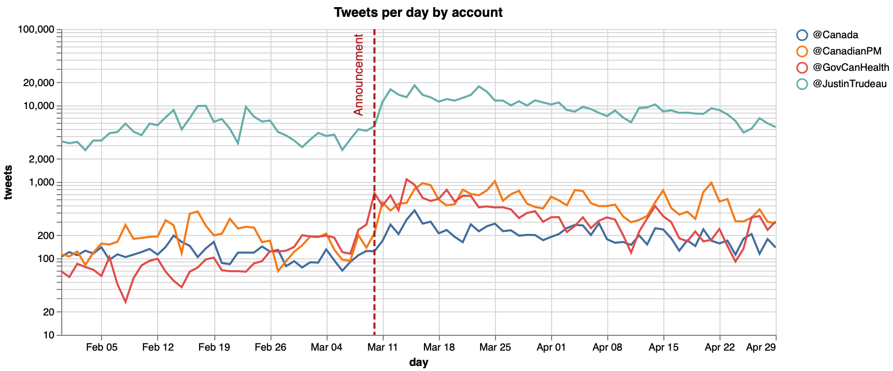
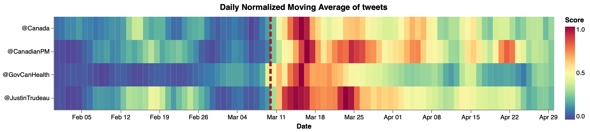
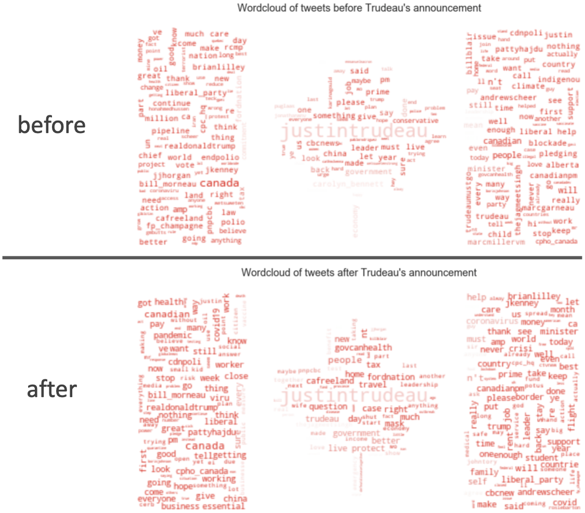
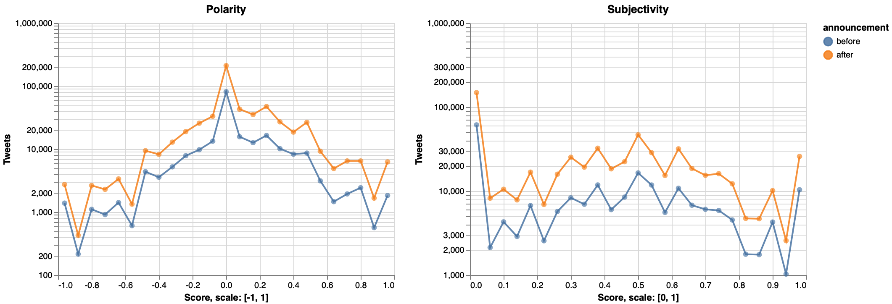
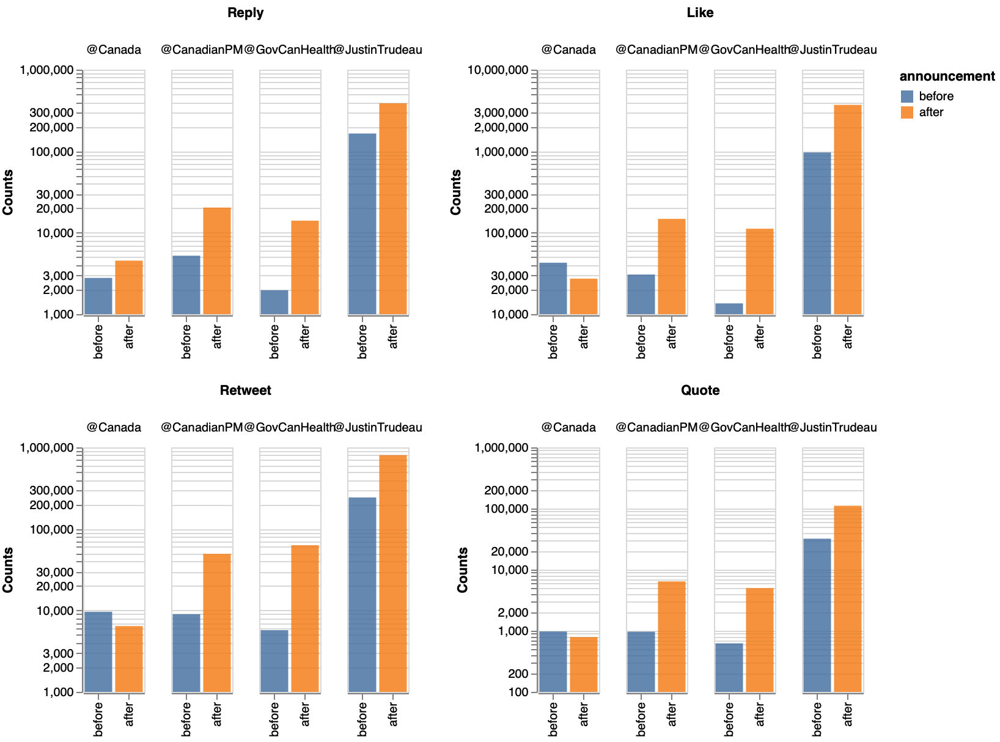

# Canada response to Covid-19
*Sentiment analysis of people's tweets referring to Canadian Government's accounts after Government announcement of policies as response of Covid-19.*

[](https://opensource.org/licenses/MIT)

## Authors
|Name |Github| Webpage |
|:----|:-----|:-------:|
|Victor Cuspinera | [vcuspinera](https://github.com/vcuspinera) | [](https://vcuspinera.github.io) |
|Leopoldo Cuspinera | [cuspime](https://github.com/cuspime) | [](https://cuspime.github.io) |

## Overview
The idea of this project was born on March 2020, when the Prime Minister of Canada, Justin Trudeau, announced a series of policies to help Canadians cope with the Covid-19. While the first announcement on **March 11th, 2020** outlined [Canada’s whole-of-government response to COVID-19 outbreak](https://youtu.be/YunI2PNZKxg), posterior press conferences on [March 13th](https://www.youtube.com/watch?v=u70pUm7xHo0&t) and [March 27th](https://youtu.be/1o-tV0A87l8), the Prime Minister announced a stimulus package would be addressed to those affected by the pandemic amongst whom small businesses and employees.

The main objective of this project is to analyse how people perceived the canadian governmental response to the pandemia by making a sentiment analysis on people's tweets mentioning Canadian Government's accounts as [@Canada](https://twitter.com/canada?lang=en), [@CanadianPM](https://twitter.com/CanadianPM), [@JustinTrudeau](https://twitter.com/JustinTrudeau?s=20) and [@GovCanHealth](https://twitter.com/govcanhealth?lang=en).

## Downloading tweets
To compare the public opinion before and after Trudeau's announcement in the Twittersphere, the first obvious step is getting the tweets. We decided to make a thorough scrapping of tweets from February 1st 2020 to April 30th 2020 that mentioned at least one of the four aforementioned accounts of the Canadian Government.

### Getting the tweets
#### What didn't work: `Twitter API` and `GetOldTweets3` library
For completeness, we'll mention what did not work. Our very first attempt made use of the [Twitter API](https://github.com/vcuspinera/Canada_response_covid/blob/master/src/twitter-search_v1_TwitterAPI.ipynb). 
For this reason, we get a twitter developer's account<sup><a name="myfootnote1">1</a></sup>. 
However, the standard twitter developer's account only gives access to search historic databases with a 7-day limit, which prevents us from reaching tweets older than a week at the time of making use of the API. This approach was thus discarded.

As a second approach we used the [GetOldTweets3 library](https://github.com/vcuspinera/Canada_response_covid/blob/master/src/twitter-search_v2_GetOldTweets3.ipynb), which initially gave us satisfactory results.
However due the changes in Twitter's API in late 2020 and poor maintenance of the GetOldTweets3 library, some packages no longer function. Strike two.

#### What worked for the current version of the project: `snscrape` library
Our final and successful approach to get the wanted tweets was using the [snscrape](https://github.com/vcuspinera/Canada_response_covid/blob/master/src/twitter-search_v3_snscrape.ipynb). 

In this case, we use the development version of snscrape to access information directly from tweets instead of tweet URLs:
```
!pip3 install git+https://github.com/JustAnotherArchivist/snscrape.git
```

An important point is that this package works _directly from the terminal_ with Command Line Interface (CLI) so, in this case, we didn't need to call it as a library but we use the OS library for Python to execute snscrape with CLI commands in Python. The following snippet shows how to use it in python:

```python
# Libraries
import os
import pandas as pd

# Use OS library to call snscrape with CLI in Python and save tweets
os.system("snscrape --jsonl --max-results 1_000 --since 2020-02-01 twitter-search 'JustinTrudeau until:2020-02-02' > ../tweets/JustinTrudeau_2020-02-01.json")

# Call tweet's json files as Data Frame
df = pd.read_json('../tweets/JustinTrudeau_2020-02-01.json', lines=True)
```

With the snscrape package we can download as many as 100,000 tweets per day per Twitter account of the Government of Canada. This produced 360 `JSON` files, which are stored in the [tweets_ folder](https://github.com/vcuspinera/Canada_response_covid/tree/master/tweets) of this repository.

Subsequently, we made a selection of columns that would provide us the information we needed and merged these files under the name *tweets_db.json*

[⭐️ click here](https://github.com/vcuspinera/Canada_response_covid/blob/master/src/twitter-search_v3_snscrape.ipynb) to see more details about how we download tweets with `snscrape`.

### Preprocessing tweets
Our final step of this section was [preprocessing the tweets](https://github.com/vcuspinera/Canada_response_covid/blob/master/src/preprocess.py) to delete some of the sensible information as emails and urls.<sup><a name="myfootnote2">2</a></sup> You can run the __preprocess.py__ script by writing in the Terminal at the main folder of this repository:

```
python src/preprocess.py --input_dir=tweets/ --output_dir=tweets/
```

## EDA
When plotting tweets that mention at least one of the Canadian Government Twitter accounts we find that between February and April 2020, the [@JustinTrudeau](https://twitter.com/JustinTrudeau) account had between 3.0 and 21.4 thousand tweets per day. With fewer mentions [@Canada](https://twitter.com/Canada) had between 98 and 470 tweets per day, [@CanadianPM](https://twitter.com/CanadianPM) had between 104 and 1,179 tweets per day, and [@GovCanHealth](https://twitter.com/GovCanHealth) between 30 and 1,182 tweets per day.



We calculate the Moving Averages with 7-day window, and normalize these averages by account using minimum and maximum number of tweets. With this analysis we identify the days with more tweets, removing weekly seasonality. 

In this plot we can identify an increase in number of tweets for all the Canadian Government's Twitter accounts around March 11th, 2020, with a peak of tweets between March 14th and 17th, decreasing from this point on until return to lower levels in mid-April 2020.



Now, when making sentiment analyses, we must first know what languages we will be considering. For this project, most of the scrapped tweets were written in **English** (`en`): about **85.5%** of all tweets. Followed by a group of undefined language (`und`) tweets that amount to 8.2% of the total. The third and fourth languages in the database are French (`fr`) with 3.5% and Spanish (`es`) with 1.2%. For the main analysis we used tweets wrote in English. This enhanced the reach of powerful tools like [spacy](https://spacy.io), [textblob](https://textblob.readthedocs.io/en/dev/) and [wordcloud](https://amueller.github.io/word_cloud/index.html), mainly developed for this language.


⭐️ More details of the basic analysis and EDA of this report are available [in this link](https://github.com/vcuspinera/Canada_response_covid/blob/master/src/eda.ipynb).

## Sentiment Analysis
As we have already pointed out, the sentiment analysis we made only considers tweets written in English, and use descriptive statistics based in counts of words, word clouds, time series and scores get by [spaCy](https://spacy.io).

When comparing word clouds of tweets published before and after the announcement, we observe that the most used words and their repetitions are very similar among both groups.



Wordclouds are always nice but they hardly tell us anything about the trends or distribution in opinions. For our sentiment analysis we made use of [spaCy](https://spacy.io)'s modules to extract the `polarity` and `subjectivity` of texts.<sup><a name="myfootnote3">3</a></sup>  

As wee can see in the plot below, the information conveyed by the downloaded tweets before and after the announcement provide very similar Polarity and Subjectivity curves. 
We would like you to first pay attention to the Subjectivity plot on the right. Notice the huge outlier on the left-hand side when subjectivity equals 0. This tells us that there are many tweets that give no opinion and are only informative, they are not biased to give a positive or negative opinion in any sense whatsoever. There is also an outlier when subjectivity equals one, which means they portray pure sentiment. 
This information is in agreement with the shapes given by the polarity curves. Notice how before and after the announcement the polarity is very much centered on 0 (when subjectivity is zero) and how polarity seems somewhat normal (slightly skewed and very very sharp, remember the scale is logarithmic!) with two sharp increases when polarity equals 1 and -1 (in agreement with the outlier for subjectivity equal to one).
<!-- Talking about polarity, in both groups we see mainly neutral tweets skewed to be positive. In the other hand, these tweets were much more objective than subjective.--> We also performed a hypothesis testing polarity and subjectivity on tweets before and after the announcement on sub-samples of tweets, but we couldn't reject that both means of these measures were different.



We also use Time Series to find the Trend of polarity and number of tweets. From this analysis, we find that before March 11th the trend polarity average of [@Canada](https://twitter.com/canada?lang=en) was the higher to the period after the announcement. In contrast, the trend of polarity average was lower before than after the announcement for the [@CanadianPM](https://twitter.com/CanadianPM) and [@JustinTrudeau](https://twitter.com/JustinTrudeau?s=20) accounts. In addition, the [@GovCanHealth](https://twitter.com/govcanhealth?lang=en) had almost the same levels.

In short, while the trend in sentiment decrease for the [@Canada](https://twitter.com/canada?lang=en) account, tweets related with the Canadian Prime Minister ([@CanadianPM](https://twitter.com/CanadianPM) and [@JustinTrudeau](https://twitter.com/JustinTrudeau?s=20)) had a positive impact after the announcement.


Finally, the announcement also impacted in the volume of tweets, as well the actions and reactions of users increasing the number of likes, replies, retweets and quotes.




[⭐️ click here](https://github.com/vcuspinera/Canada_response_covid/blob/master/src/sentiment_analysis.ipynb) to see more details about the sentiment analysis.

## Final comments
The aim of this project was to measure the impact of the Government policies to help Canadians cope with the COVID-19.

For this reason, we compare the sentiment analysis on Canadians before and after Trudeau's first announcement on March 11<sup>th</sup>, 2020, where the Prime Minister outlined Canada’s whole-of-government response to COVID-19 outbreak.

To measure this impact we download tweets from February 1<sup>st</sup> to April 30<sup>th</sup> mentioning any of the four selected Canadian Government's Twitter accounts ([@JustinTrudeau](https://twitter.com/JustinTrudeau?s=20), [@CanadianPM](https://twitter.com/CanadianPM), [@Canada](https://twitter.com/canada?lang=en) and [@GovCanHealth](https://twitter.com/govcanhealth?lang=en)), and compare the polarity and subjectivity of tweets published before and after the announcement.

On the analysis we find that the announcement on March 11<sup>th</sup>, and the following announcements of the Government policies related with Covid-19, had an impact in the sentiment of tweets and their volume: 

- __Sentiment__: while the overall sentiment of tweets is positive, the announcement had different effect for the Government accounts. While the effect on [@Canada](https://twitter.com/canada?lang=en) account was a decrease in the average polarity, in the other hand we identify a rise in the positive sentiment of tweets related with the Canadian Prime Minister (which means an increase in the polarity levels of [@CanadianPM](https://twitter.com/CanadianPM) and [@JustinTrudeau](https://twitter.com/JustinTrudeau?s=20) accounts). The [@GovCanHealth](https://twitter.com/govcanhealth?lang=en) account was stable in polarity level before and after the announcement. 
- __Volume__: we observed an increase in the total number of tweets and the average tweets per day. Also, the noncement affected the volume of actions and reactions of users increasing the number of likes, replies, retweets and quotes.

## Dependencies
|Python packages|Python packages|
|:------|:---|
|altair |re  |
|collections|scipy |
|datetime|seaborn |
|docopt |spacy|
|en_core_web_sm|spacytextblob |
|GetOldTweets3 |string|
|json   |textblob |
|matplotlib |textblob |
|numpy  |time|
|os     |twitter|
|pandas |warnings|
|PIL    |wordcloud |
|pytz   | |

## Usage
### Running recipe (recommended)
To replicate the analysis, clone this GitHub repository and follow the next steps:

1. Install the [dependencies](#dependencies) listed above.  

2. Open [`twitter-search_v2_GetOldTweets3.ipynb`](https://github.com/vcuspinera/Canada_response_covid/blob/master/src/twitter-search_v3_snscrape.ipynb) notebook located in the _src_ folder, and run all cells.

3. Run the Python script [`preprocess.py`](https://github.com/vcuspinera/Canada_response_covid/blob/master/src/preprocess.py) in the terminal from the root directory of this project to identify and delete sensible information.
_⚠️ Caution: [this process take close to 2 hr](https://github.com/vcuspinera/Canada_response_covid/blob/master/img/preprocess_times.png)_
```
python src/preprocess.py --input_dir=tweets/ --output_dir=tweets/
```

4. Open and run [`eda.ipynb`](https://github.com/vcuspinera/Canada_response_covid/blob/master/src/eda.ipynb) notebook located in the _src_ folder.

5. Open and run [`twitter_trend.ipynb`](https://github.com/vcuspinera/Canada_response_covid/blob/master/src/twitter_trend.ipynb) notebook.

6. Open and run [`cleaning_adds.ipynb`](https://github.com/vcuspinera/Canada_response_covid/blob/master/src/cleaning_adds.ipynb) notebook.

7. Run the Python script [`tweets_sentiment.py`](https://github.com/vcuspinera/Canada_response_covid/blob/master/src/tweets_sentiment.py) in the terminal to select only tweets written in English and add Polarity and Subjectivity scores from spaCy.  
_⚠️ Caution: [this process take around to 3.5 hr](https://github.com/vcuspinera/Canada_response_covid/blob/master/img/tweets_sentiment_times.png)_
```
python src/tweets_sentiment.py --input_file=tweets/tweets_db_clean.json --output_dir=tweets/
```

8. Open and run [`sentiment_analysis.ipynb`](https://github.com/vcuspinera/Canada_response_covid/blob/master/src/sentiment_analysis.ipynb) notebook.

## Main references
- Prime Minister outlines Canada’s COVID-19 response, on March 11 of 2020: [official announce](https://pm.gc.ca/en/news/news-releases/2020/03/11/prime-minister-outlines-canadas-covid-19-response) and [video](https://youtu.be/YunI2PNZKxg).
- [@JustinTrudeau](https://twitter.com/JustinTrudeau?s=20). Official account of Justin Trudeau as public person, and 23rd Prime Minister of Canada. Twitter.
- [@CanadianPM](https://twitter.com/CanadianPM). Official account of the Prime Minister of Canada. Twitter.
- [@Canada](https://twitter.com/canada?lang=en). Showcasing Canada to the world. Twitter.
- [@GovCanHealth](https://twitter.com/govcanhealth?lang=en). Health Canada and Public Health Agency of Canada. Twitter.

[⭐️ Click here](https://github.com/vcuspinera/Canada_response_covid/blob/master/References.md) to access the complete list of references for this project.

<br>

---
<sup>[[1]](#myfootnote1) If you are interested to get the twitter developer's account, [click here](https://github.com/vcuspinera/Canada_response_covid/tree/master/keys) to see details and recommendation to get one.</sup>

<sup>[[2]](#myfootnote2) We didn't delete all the sensible information nor anonymize the tweets because we loosed important tokens as _Trudeau_ or the tags to official Twitter accounts of Canadian Government.</sup>

<sup>[[3]](#myfootnote3) `polarity` score is a float within the range [-1.0, 1.0] where -1.0 is a very negative tweet and 1.0 is positive one. In the other hand, `subjectivity` is a float within the range [0.0, 1.0] where 0.0 is very objective and 1.0 is very subjective.</sup>
