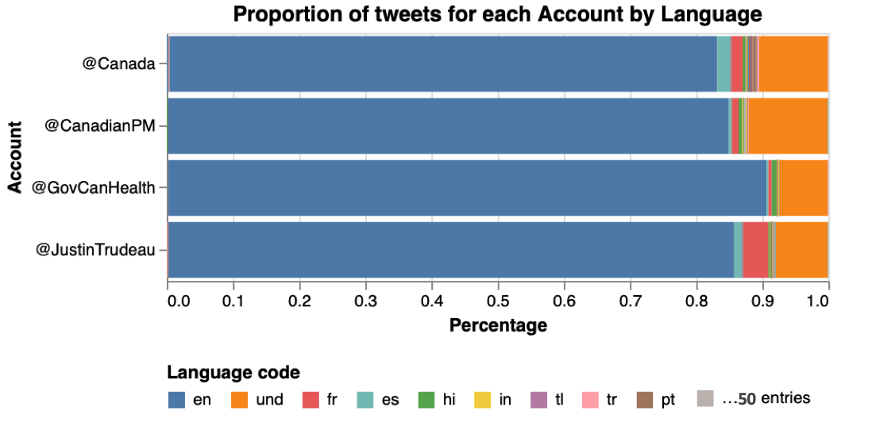

# Canada response to Covid-19
*Sentiment analysis of people's tweets refeering to Canadian Government's accounts after Government announcement of policies as response of Covid-19.*

[](https://opensource.org/licenses/MIT)

## Authors

|Name |Github| Webpage |
|:----|:-----|:-------:|
|Victor Cuspinera | [vcuspinera](https://github.com/vcuspinera) | [](https://vcuspinera.github.io) |
|Leopoldo Cuspinera | [cuspime](https://github.com/cuspime) | [](https://cuspime.github.io) |


## Overview
The idea of this project was born after March 27th, 2020, when the Prime Minister of Canada, Justin Trudeau, [announced a series of policies facing impacts of Covid-19](https://youtu.be/1o-tV0A87l8) to support small businesses and their employees.  

The objective of this project is to analyse the Canadian Government response to Covid-19 through the precepetion of the people by making sentiment analysis on people's tweets mentioning Canadian Government's accounts as [@JustinTrudeau](https://twitter.com/JustinTrudeau?s=20), [@CanadianPM](https://twitter.com/CanadianPM), [@Canada](https://twitter.com/canada?lang=en) and [@GovCanHealth](https://twitter.com/govcanhealth?lang=en).


## Retrieving tweets
To compare the tweets before and after Trudeau announcement, the first step was getting the tweets from March 1st to April 30th, from the four official-accounts selected from the Government of Canada.

### Getting the tweets
Our first attempt was using the [Twitter API](https://github.com/vcuspinera/Canada_response_covid/blob/master/src/twitter-search_v1_TwitterAPI.ipynb). For this reason we get a twitter developer's account<sup><a name="myfootnote1">1</a></sup>. However, the standard twitter developer's account only gives access to search historic databases with a 7-day limit, which means that I was not able to find tweets for a date older than one week, so this approach was not useful for the objective of our project.

For our second approach we used the [GetOldTweets3 library](https://github.com/vcuspinera/Canada_response_covid/blob/master/src/twitter-search_v2_GetOldTweets3.ipynb). This innitially worked, however due the changes in Twitter's API in late 2020, GetOldTweets3 is not longer functioning.

The final (and succesful) approach to get the wanted tweets was using the [snscrape package](https://github.com/vcuspinera/Canada_response_covid/blob/master/src/twitter-search_v3_snscrape.ipynb). This package allowed us to find old tweets as opposed to the free version of the API from twitter, and the GetOldTweets3 library that is non-currently working.

With the snscrape package we download a maximum of 100,000 tweets saving them in one file per each day for each account. This means that we got 244 `JSON` files, storaging them in the [_tweets_ folder of this repository](https://github.com/vcuspinera/Canada_response_covid/tree/master/tweets).

Subsequently, we merged some selected columns of these files in one file named _tweets_db.json_.


### Preprocessing tweets
Our final step of this section was [preprocessing the tweets](https://github.com/vcuspinera/Canada_response_covid/blob/master/src/preprocess.py) to delete some of the sensible information as emails and urls.<sup><a name="myfootnote2">2</a></sup> You can run the preprocess.py script by writing in the Terminal at the main folder of this repository:

```
python src/preprocess.py --input_dir=tweets/ --output_dir=tweets/
```

## EDA

When comparing the tweets per day by Canadian Government Twitter accounts, we find that between March and April 2020, [@Canada](https://twitter.com/Canada) had between 29.1 and 62.4 thousand tweets per day, followed by [@JustinTrudeau](https://twitter.com/JustinTrudeau) that had between 3.5 and 29.7 thousand tweets per day. While @Canada and @JustinTrudeau accounts had more than 3 thousand tweets, Twitter's users published between 131 and 1,207 tweets naming [@CanadianPM](https://twitter.com/CanadianPM), and between 105 and 1,188 tweets with [@GovCanHealth](https://twitter.com/GovCanHealth).


The retrieved tweets were mainly written in English -around 85%-, followed by Spanish and French. Also, a large number of tweets have an undefined language. For this reason, in the main analysis we could select a subset of tweets wrote in English to use usefull tools as [SpaCy](https://spacy.io), [textblob](https://textblob.readthedocs.io/en/dev/) and [wordcloud](https://amueller.github.io/word_cloud/index.html).



When normalizing the number of tweets by account, we can identify the days with more tweets for each account. With the following plot we can identify a higher number of tweets for all twitter accounts between March 12 and March 29, 2020.


More details of the basic analysis and EDA of this report are available [in this link](https://github.com/vcuspinera/Canada_response_covid/blob/master/src/eda.ipynb).

## Sentiment Analysis
The sentiment analysis is available in [this link](https://github.com/vcuspinera/Canada_response_covid/blob/master/src/sentiment_analysis.ipynb).

## Results
_⚠️ Coming soon_

## Dependencies

|Python packages|Python packages|
|:---|:---|
|altair |pytz|
|collections|re|
|datetime|seaborn |
|docopt |spacy|
|en_core_web_sm|spacytextblob |
|GetOldTweets3 |string|
|json|textblob |
|matplotlib |textblob |
|numpy |time|
|os|twitter|
|pandas|warnings|
|PIL |wordcloud |

## Usage

**Running recipe (recommended)**
To replicate the analysis, clone this GitHub repository, and follow the next steps:

1. Install the [dependencies](#dependencies) listed above. 

2. Open [`twitter-search_v2_GetOldTweets3.ipynb`](https://github.com/vcuspinera/Canada_response_covid/blob/master/src/twitter-search_v3_snscrape.ipynb) notebook located in the _src_ folder, and run all cells.

3. Run the Python script [`preprocess.py`](https://github.com/vcuspinera/Canada_response_covid/blob/master/src/preprocess.py) in the terminal from the root directory of this project to prepare data for the models.
```
python src/preprocess.py --input_dir=tweets/ --output_dir=tweets/
```

4. Open and run [`eda.ipynb`](https://github.com/vcuspinera/Canada_response_covid/blob/master/src/eda.ipynb) notebook.

5. Run the Python script [`tweets_sentiment.py`](https://github.com/vcuspinera/Canada_response_covid/blob/master/src/tweets_sentiment.py) in the terminal from the root directory of this project to prepare data for the models.
```
python src/tweets_sentiment.py --input_file=tweets/tweets_db_clean.json --output_dir=tweets/
```

6. Open and run [`sentiment_analysis.ipynb`](https://github.com/vcuspinera/Canada_response_covid/blob/master/src/sentiment_analysis.ipynb) notebook.

## Main references
- [Justin Trudeau – Prime Minister of Canada. (March 27, 2020). *Announcing support for small businesses facing impacts of COVID-19*. Retrieved: 2019-05-18](https://youtu.be/1o-tV0A87l8)
- [@JustinTrudeau](https://twitter.com/JustinTrudeau?s=20). Official account of Justin Trudeau as public person, and 23rd Prime Minister of Canada. Twitter.
- [@CanadianPM](https://twitter.com/CanadianPM). Official account of the Prime Minister of Canada. Twitter.
- [@Canada](https://twitter.com/canada?lang=en). Showcasing Canada to the world. Twitter.
- [@GovCanHealth](https://twitter.com/govcanhealth?lang=en). Health Canada and Public Health Agency of Canada. Twitter.

[Click here](https://github.com/vcuspinera/Canada_response_covid/blob/master/References.md) to access the complete list of references for this project.

<br>

---
<sup>[[1]](#myfootnote1) If you are interested to get the twitter developer's account, [click here](https://github.com/vcuspinera/Canada_response_covid/tree/master/keys) to see details and recomendation to get one.</sup>

<sup>[[2]](#myfootnote2) We didn't delete all the sensible information nor anonymize the tweets because we losed important tokens as _Trudeau_ or the tags to official Twitter accounts of Canadian Government.</sup>